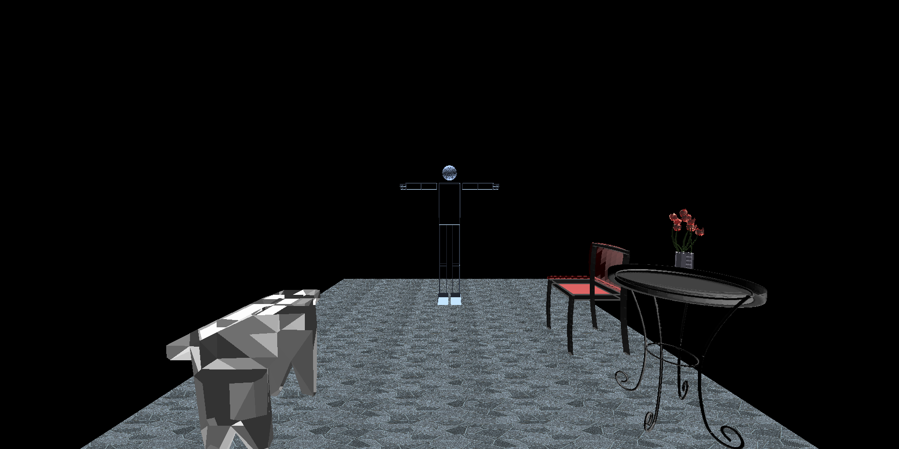
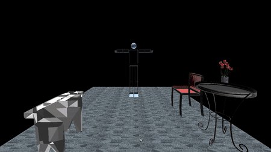
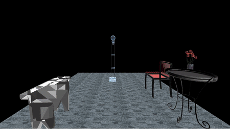
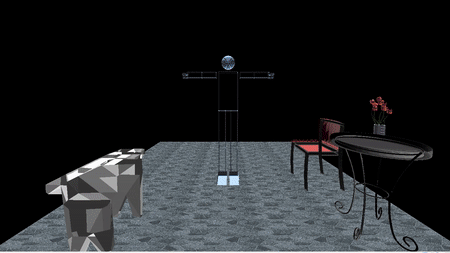
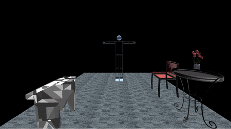
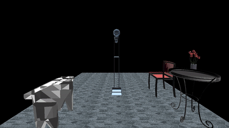
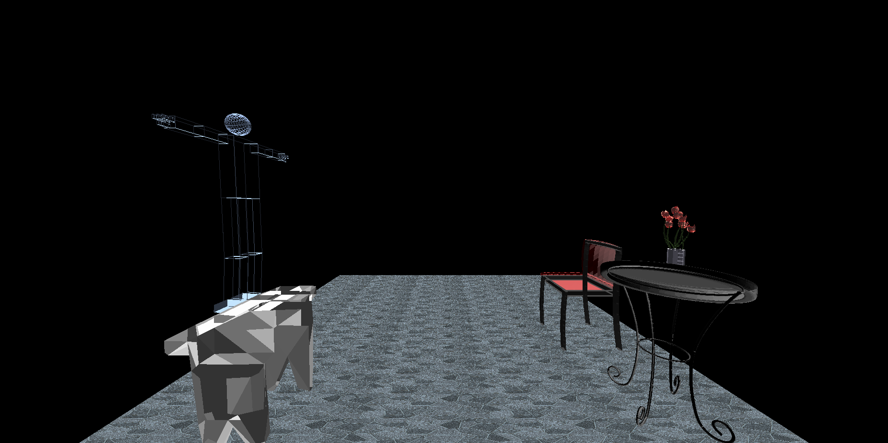
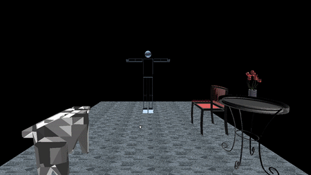
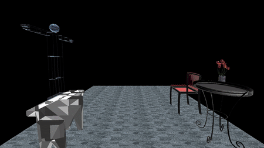

## [SBE306B] Task 3 Texture & Models & and medical visualization
## Team 5
## **Submitted to** &nbsp; Eng. Eslam Adel  &nbsp; Eng. Ayman Anwar 
|Name | Sec| BN|
|---|---|---|
|            |        |      |
| Alaa Tarek Samir | SEC:1 | BN:12 |
| Amira Gamal Mohamed Omar | SEC:1 | BN:15 |
| Dalia Lotfy AbdElhay | SEC:1 | BN:31 |
| Fatma Huessien Wageh | SEC:2 | BN:6 |
| Mariam Mohamed Osama | SEC:2 | BN:25 |
# Part 1
## Description
We were assigned to make a full scene containing a robotic body and different objects related to each other to make the scene more realstic.

We were also assigned to draw a floor and apply different types of texture to it and changing between them using a drop menu.

There are different types of animation applied in this project, some of them applied on the robotic body itself, and the other show the interaction between the robotic body and the objects in the scene.

The light and colors of the scene are also adjustetd to make it appear as in the following image.
## The scene

## Body Movements
- for the right shoulder: we use  **y** key to rotate up ,**Y** to rotate down. 
- for the left shoulder: we use  **t** key to rotate up ,**T** to rotate down.
- the right shoulder can rotate around x axis using **q** and **Q**
- the left shoulder can rotate around x axis using **o** and **O**
- for the right arm: we use  **r**  key to rotate up , **R** to rotate down. 
- for the left arm: we use  **e** key to rotate up ,**E** to rotate down.
- for the fingers of right arm: we use  **d**  key to rotate up , **D** to rotate down. 
- as for flangs of right arm:we use  **a**  key to rotate up , **A** to rotate down.
- for the fingers of left arm: we use  **f** key to rotate up ,**F** to rotate down.
-  as for flangs of left arm:we use  **s**  key to rotate up , **S** to rotate down.
- for the right hip: we use  **H**  key to rotate up , **h** to rotate down.
- for the right hip: we use  **j**  key to rotate up , **J** to rotate down around z direction. 
- for the left hip: we use  **L** key to rotate up  ,**l** to rotate down.
- for the left hip: we use  **w** key to rotate up around  z direction ,**W** to rotate down around  z direction.
- for the right knee: we use  **k**  key to rotate up , **K** to rotate down. 
- for the left knee: we use  **g** key to rotate up ,**G** to rotate down.
## Camera Movement
- **up movememnt:** up arrow
- **down movememnt:** down arrow
- **right movememnt:** right arrow
- **left movememnt:** left arrow
- **moving forward:** "+" 
- **moving backward:** "-" 
## Animations
**Animations applied on the robotic body only**
- The robot can walk forward in both z-direction and x-direction and it can also rotate right or left around y- axis.
**Animations applied to show the interaction between the robotic body and the objects in the scene**

we make the robot jump and stand on the table by translations on y and x directions.
## Walk Forward
There are 2 different joints moving and rotating for this motion which are hip joint and knee joint.
## walk in z-direction
we set up movement limitation for the robot not to exceed the  floor 6.5 in +ve z-direction and 0.25 in -ve z-direction



## walk in x-direction
as for the walking in x-direction, the limitations are  6 in +ve x-direction and 4  in -ve x-direction



```c++
void walkForward(int value)
{
    /*
     Move the body in the forward direction
     */


    // Reached End of the floor
    if (z_body > 6.5 || z_body<-0.25 || x_body>6 || x_body<-4) {
        leg_state = 0;

        // Return Body to normal state
        leg1[0] = 0;
        knee[0] = 0;
        leg1[1] = 0;
        knee[1] = 0;

        
    }

    switch (leg_state)
    {
        case 1:
            if (leg1[0] < 30) {
                // Move Body
                // Check on movement's direction
                if (mainBody == 0) {
                    z_body += 0.03;
                } else if (mainBody == -90 || mainBody == 270) {
                    x_body -= 0.03;
                } else if (mainBody == -180 || mainBody == 180) {
                    z_body -= 0.03;
                } else if (mainBody == -270 || mainBody == 90) {
                    x_body += 0.03;
                }

                // Move Right Leg Forward
                leg1[0] += 1;
                knee[0] -= 1;

                // Move Left Leg Backward
                if (leg1[1] > -30)
                {
                    leg1[1] -= 1;
                    knee[1] -= 1;
                }

            } else {
                leg_state = 2;
            }
            glutTimerFunc(10, walkForward, 0);
            break;

        case 2:
            if (leg1[0] > 0) {
                // Move Body
                // Check on movement's direction
                if (mainBody == 0) {
                    z_body += 0.03;
                } else if (mainBody == -90 || mainBody == 270) {
                    x_body -= 0.03;
                } else if (mainBody == -180 || mainBody == 180) {
                    z_body -= 0.03;
                } else if (mainBody == -270 || mainBody == 90) {
                    x_body += 0.03;
                }

                // Move Right Leg
                leg1[0] -= 1;
                knee[0] += 1;

                // Return Left Leg
                if (leg1[1] < 0)
                {
                    leg1[1] += 1;
                    knee[1] += 1;
                }
            }
            else {
                leg_state = 0;
            }
            glutTimerFunc(10, walkForward, 0);
            break;
        case 0:
            leg_state = 1;
            break;

        default:
            break;

    }
    glutPostRedisplay();
}
```
## Rotate Right
- The body will rotate right about his self </br>

```c++
void rotateBodyRight(int value)
{// this function for animaton of rotating the body right
    if (mainBody > value) {
        mainBody = (mainBody - 1) % 360;
        rCounter += 1;
        glutTimerFunc(10, rotateBodyRight, mainBody + rCounter - 90);
    } else {
        rCounter = 0;
    }
    glutPostRedisplay();
}
```
## Rotate Left

-The body will rotate left abount his self</br>


```c++
void rotateBodyLeft(int value)
// this function for animaton of rotating the body left
{
    if (mainBody < value) {
        mainBody = (mainBody + 1) % 360;
        rCounter += 1;
        glutTimerFunc(10, rotateBodyLeft, mainBody - rCounter + 90);
    } else {
        rCounter = 0;
    }
    glutPostRedisplay();
}
```
## Jump over
The knee joint will rotate to make the movement 





```c++
void jumpOver(int heightValue)
{
    /*
     This function makes the robotic body jumps over the table for the animation interaction
     */

    switch (jump_state)
    {
        // Jumping
        case 1:
            if (y_body < float(heightValue))
            {
                y_body += 0.5;
                x_body -= 0.5;

                // Moving the knees
                knee[1] -= 1;
                knee[0] -= 1;
            } else {
                jump_state = 2;
            }
            glutTimerFunc(1000/60, jumpOver, heightValue);
            break;

        // Returning Back
        case 2:
            if(y_body > returningPosition)
            {
                y_body -= 0.5;
                x_body -= 0.5;

                knee[1] += 1;
                knee[0] += 1;
            } else if (y_body < returningPosition) {
                jump_state = 0;
            }
            glutTimerFunc(1000/60, jumpOver, heightValue);
            break;

        default:
            break;
    }
    glutPostRedisplay();
}
```
**Note** 
applying any other animation movement should wait till the end of the previous one .

## Animations buttons
- **Rotate Right:** "m"
- **Rotate Left:** "M"
- **Walk Forward** "n"
- **Jump Over** "N"
```c++
void keyboard(unsigned char key, int x, int y)
{
    switch (key)
    { //  Jump over
    case 'N':
            jumpOver(4);
            break;
    case 'n':
            walkForward(0);
            break;
        // Whole Body rotation
    case 'm':
            rotateBodyRight( mainBody - 90);
           
            break;
    case 'M':
            rotateBodyLeft(mainBody + 90);
            
            break;
    }
}
```
## Texture Mapping



We applied four different textures with the navigate between them using a drop menu pinned to the right click of the mouse.</br>

**Note** : The default floor texture is **floor3**.
Images are saved in bmp format.
### Draw texture
```c++
void drawFloorTexture(GLuint textID) {
    
    glPushMatrix();
    glEnable(GL_TEXTURE_2D);
    glBindTexture(GL_TEXTURE_2D, textID);

    glTexParameteri(GL_TEXTURE_2D, GL_TEXTURE_MIN_FILTER, GL_NEAREST);
    glTexParameteri(GL_TEXTURE_2D, GL_TEXTURE_MAG_FILTER, GL_NEAREST);
    glTexParameteri(GL_TEXTURE_2D, GL_TEXTURE_MIN_FILTER, GL_LINEAR);
    glTexParameteri(GL_TEXTURE_2D, GL_TEXTURE_MAG_FILTER, GL_LINEAR);

    glBegin(GL_QUADS);

    glNormal3f(0.0, -1.0, 0.0);
    glTexCoord2f(0.0f, 0.0f);
    glVertex3f(-7, -0.25, 7);

    glTexCoord2f(5.0f, 0.0f);

    glVertex3f(7, -0.25, 7);

    glTexCoord2f(5.0f, 20.0f);

    glVertex3f(7, -0.25, -7); 

    glTexCoord2f(0.0f, 20.0f);

    glVertex3f(-7, -0.25, -7); 

    glEnd();
    glDisable(GL_TEXTURE_2D);

    glPopMatrix();
}
```
### Display the floor
```c++
void display(void)
{
// Draw The Texture on The Floor
    glPushMatrix();
    glTranslatef(0,-3.75,0);
    drawFloorTexture(textureId);
    glPopMatrix();
}
```
### Choose Texture with a drop menu
```c++
void Choose_texture(int id)
{
    /*
     
        This function is responsible for changing the texture of the floor
        using a drop menu by the right click action on the mouse.
     */
    switch (id)
    {
    case 1:
        initRendering("Floor1.bmp", textureId);
        break;

    case 2:
        initRendering("Floor2.bmp", textureId);
        break;

    case 3:
        initRendering("Floor3.bmp", textureId);
        break;

    case 4:
        initRendering("Floor4.bmp", textureId);
        break;

    default:
        break;
    }
    glutPostRedisplay();
}
```
## Loading Objects
We used glm library for uploading four different objects and their files extensions *.obj* and *.mtl*
### Draw model
```c++
//for round table
void drawmodel1(void)
{
    if (!pmodel) {
        pmodel = glmReadOBJ("data/roundTable2.obj");
        if (!pmodel) exit(0);
        glmUnitize(pmodel);
        glmFacetNormals(pmodel);
        glmVertexNormals(pmodel, 90.0);
        glmScale(pmodel, .15);
    }
    glmDraw(pmodel, GLM_SMOOTH | GLM_MATERIAL);
}
```
### Display Model
```c++
void display(void){
    //draw circular table model
    glPopMatrix();
    glPushMatrix();
    glTranslatef(7.0, -3.75, 1.5);
    glRotatef(-90, 0, 1, 0);
    glScalef(15, 15, 15);
    drawmodel1();
    glPopMatrix();
}
```
## Lighting 
Two Light sources are applied with a diffuse mode and a white light, turning the scene from complete darkness to light.
```c++
void display(void){
  // two light sources and whight light
    GLfloat left_light_position[] =
            {0.0, 10.0, 1.0, 0.0}, right_light_position[] =
            {0.0, -10.0, 1.0, 0.0}, white_light[] =
            {1.0, 1.0, 1.0, 0.0};
    // Material Properties
    GLfloat mat_amb_diff[] = {0.643, 0.753, 0.934, 1.0};
    GLfloat mat_specular[] = { 0.0, 0.0, 0.0, 1.0 };
    GLfloat shininess[] = {10.0};
    glPushMatrix();
        glLightfv(GL_LIGHT0, GL_POSITION, left_light_position);
        glLightfv(GL_LIGHT0, GL_AMBIENT_AND_DIFFUSE, white_light);
        glLightfv(GL_LIGHT1, GL_POSITION, right_light_position);
        glLightfv(GL_LIGHT1, GL_AMBIENT_AND_DIFFUSE, white_light);
    glPopMatrix();

    //materials properties
    glMaterialfv(GL_FRONT_AND_BACK, GL_AMBIENT_AND_DIFFUSE,mat_amb_diff);
    glMaterialfv(GL_FRONT, GL_SPECULAR, mat_specular);
    glMaterialfv(GL_FRONT, GL_SHININESS, shininess);
}
```
## Reset Function
We use a reset function to return the camera to its starting position.
and to return the bodey movements to their original position.
**Reset Key**: "b"

```c++
void reset()
{
    double e[] = { 0.0, 0.5, 9.0 };
    double c[] = { 0.0, 0.0, 0.0 };
    double u[] = { 0.0, 1.0, 0.0 };
    for (int i = 0; i < 3; i++)
    {
        eye[i] = e[i];
        center[i] = c[i];
        up[i] = u[i];
    }
    angle = 0;
    angle2 = 0;
    x_body=0;
    y_body=0;
    z_body=0;
    mainBody=0;
}
```
## Problems
- Most of texture maps are in jpg format.
- Materials and their effect on the scene lighting
## Solutions
- We convert the jpg texture mapping images to bpm using:
  [Convert to bmp](https://l.facebook.com/l.php?u=https%3A%2F%2Fconvertio.co%2Fjpg-bmp%2F%3Ffbclid%3DIwAR1ljU8lQaCfI3pIyhzAVuwHcFFg89xnCw3TxB4pi82Vg46dQF9H3CE_DgQ&h=AT2DyxyPkQ6ltS9h_wnp16vtaL4_6d0zcj7J-4bI4xMPXAZzL0budQoWVf8b5URi4QJaBcqoidPjZbut3H4CxtKHAnpxwqGTUTu9kd0Natv8WSNL4QV5Ln2ubasYEA)
- We added some material properties to avoid their effect on light.
